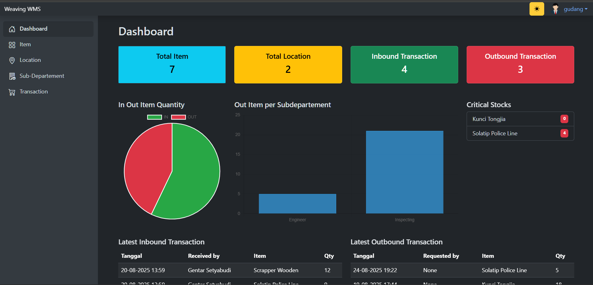

# Weaving WMS

**Weaving WMS (Warehouse Management System)** is a Django-based web application designed to manage inventory, track in/out transactions, and handle item lending/return processes in a warehouse environment.

## 🚀 Features
- 🔐 **Authentication & Authorization**
  - Login with "Remember Me" option
  - Protected routes (redirect to login if not authenticated)
  - Role-based access (Admin / User)

- 📦 **Inventory Management**
  - Add, edit, delete items
  - Item categories & units
  - Barcode support

- 🔄 **Transactions**
  - Record IN / OUT transactions
  - Generate transaction reports (PDF export)

- 👨‍💼 **Employee Management**
  - Manage employee records
  - Item lending and returning process

- 📊 **Dashboard**
  - Inventory overview
  - Transaction statistics

## 🛠️ Tech Stack
- [Python 3](https://www.python.org/)
- [Django 5](https://www.djangoproject.com/)
- [Bootstrap 5](https://getbootstrap.com/) (UI/Frontend)
- [SQLite / PostgreSQL](https://www.postgresql.org/) (Database)
- [ReportLab](https://www.reportlab.com/) (PDF Export)

## 📂 Project Structure
weaving-wms/
├── wms/ # Main app (models, views, urls, templates)
├── static/ # CSS, JS, and assets
├── templates/ # Global HTML templates
├── manage.py
└── README.md


## ⚡ Getting Started
1. **Clone Repository**
   ```bash
   git clone https://github.com/<username>/weaving-wms.git
   cd weaving-wms

2. **Create Virtual Environment & Install Dependencies**
    python -m venv env
    source env/bin/activate   # Linux/Mac
    env\Scripts\activate      # Windows

    pip install -r requirements.txt

3. **Apply Database Migrations**
    python manage.py migrate
4. **Create Superuser**
    python manage.py createsuperuser
5. **Run Development Server**
    python manage.py runserver

    open in browser : http://127.0.0.1:8000

📸 Screenshots
    

📜 License
    This project is licensed under the MIT License – feel free to use, modify, and distribute it.